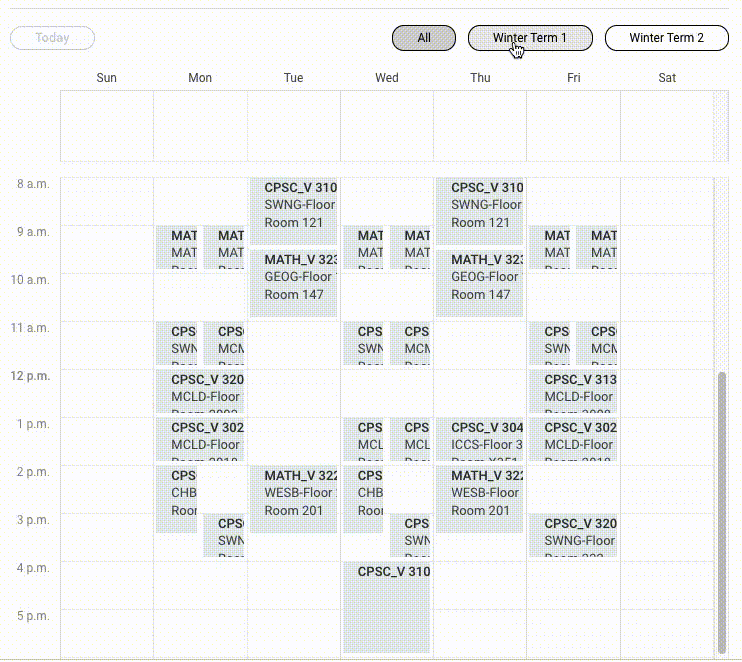

# UBC Workday Calendar by Term Extension

Enables the choices of only viewing your registered courses by Term 1 or Term 2 instead of the full year on Workday!
Works for both Winter Term and Summer Term.

Extension built with JavaScript and CSS.

## Installation

To install this project, clone the repository, then load the unpacked extension onto Chrome through the manage extensions
settings interface. This option is only enabled when developer mode has been turned on in the Chrome extension settings.

## Issues & Requests

Feel free to open an issue on this GitHub!